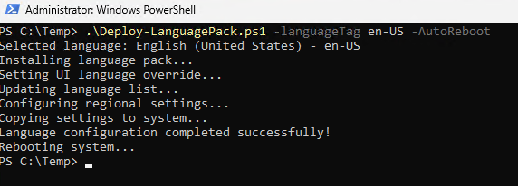
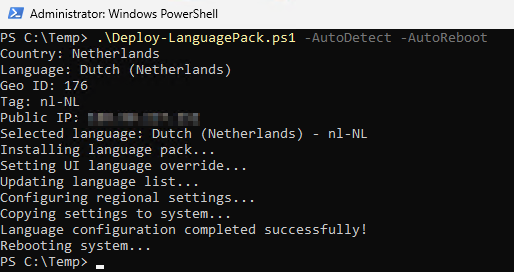

# Deploy-LanguagePack.ps1
This PowerShell script automates the installation and configuration of language packs on Windows devices. It supports both manual language selection and automatic detection based on the user's public IP address.

## Features
- Install a specified language pack
- Automatically detect language based on public IP address
- Set the default system language
- Update regional settings
- Apply configuration to the system and new user profiles
- Optionally reboot the system after configuration
- Rollback to the original language configuration
- Timezone overwrite possibility that isn't matching with language tag/region

## Usage
### Parameters
- `-languageTag`: Specify the language tag to install (e.g., `en-US`, `fr-FR`). A list of valid language tags can be found [here](https://learn.microsoft.com/en-us/windows-hardware/manufacture/desktop/available-language-packs-for-windows?view=windows-11#language-packs).
- `-TimeZone`: Specify the time zone to set (e.g., `Pacific Standard Time`, `Central European Standard Time`).
- `-AutoDetect`: Automatically detect the language based on the public IP address.
- `-AutoReboot`: Automatically reboot the system after applying the language configuration.
- `-rollback`: Rollback to the original language configuration.

### Examples
### Important Note
> **Warning**: Ensure that VPN or proxy scenarios are considered, as they can impact the accuracy of the language detection based on the public IP address. It is recommended to manually specify the language tag in such cases to avoid incorrect language deployment.


#### Install a Specific Language Pack
```powershell
.\Install-LanguagePack.ps1 -languageTag en-US
```
#### Automatically Detect and Install Language Pack
```powershell
.\Install-LanguagePack.ps1 -AutoDetect
```

#### Install a Specific Language Pack and Reboot
```powershell
.\Install-LanguagePack.ps1 -languageTag en-US -AutoReboot
```


#### install a Specific Language Pack, Custom TimeZone and Reboot
```powershell
.\Install-LanguagePack.ps1 -languageTag en-US -TimeZone 'W. Europe Standard Time' -AutoReboot
```

#### Automatically Detect, Install Language Pack, and Reboot
```powershell
.\Install-LanguagePack.ps1 -AutoDetect -AutoReboot
```



#### Sources
https://learn.microsoft.com/en-us/windows-hardware/manufacture/desktop/available-language-packs-for-windows?view=windows-11#language-packs
https://learn.microsoft.com/en-us/windows-hardware/manufacture/desktop/default-input-locales-for-windows-language-packs?view=windows-11#input-locales
https://learn.microsoft.com/en-us/windows/win32/intl/table-of-geographical-locations

